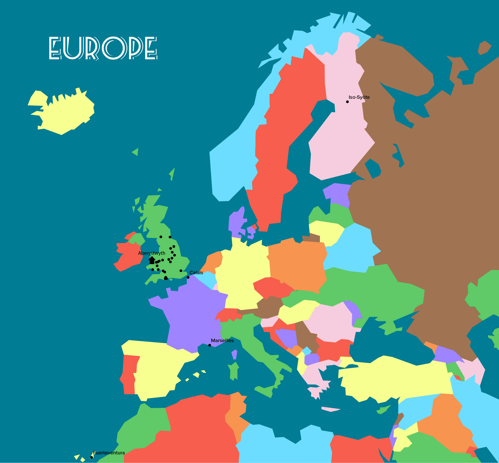
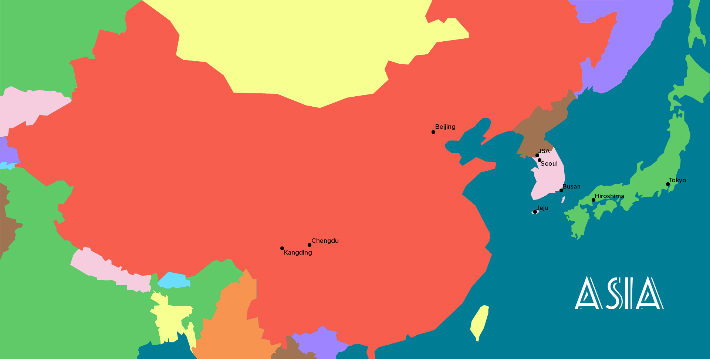

<!DOCTYPE html>
<html>
  <head>
    <meta http-equiv="content-type" content="text/html; charset=utf-8">
    <title>index</title>
    <!-- Latest compiled and minified CSS -->
    <link rel="stylesheet" href="https://maxcdn.bootstrapcdn.com/bootstrap/3.3.7/css/bootstrap.min.css"

      integrity="sha384-BVYiiSIFeK1dGmJRAkycuHAHRg32OmUcww7on3RYdg4Va+PmSTsz/K68vbdEjh4u"

      crossorigin="anonymous">
    <!-- Stylesheet provided by Bootstrap -->
    <link rel="stylesheet" href="https://maxcdn.bootstrapcdn.com/bootstrap/3.3.7/css/bootstrap-theme.min.css"

      integrity="sha384-rHyoN1iRsVXV4nD0JutlnGaslCJuC7uwjduW9SVrLvRYooPp2bWYgmgJQIXwl/Sp"

      crossorigin="anonymous">
    
  </head>
  <body>
    <!--

      
       

    
 -->
    

      

        

          <h1>About</h1>
          <h4>“I couldn’t get you to the ocean. but there was nothing stopping
            me bringing the ocean to you”  
            - Neil Gaiman</h4>
        

      

      

        

          
 
            Hi there. I’m Jamie. I’m a PhD student at Lancaster University. I'm currently travelling the
            world, visiting new countries and trying new jobs. In my spare time
            I'm a freelance photographer. I finished 2018 by working in Mexico
            (for the day of the dead) and then Finnish Lapland. 
             
          

        

      

    

    

      

        

          <h1>Travel</h1>
          <h4>“You’ll find the bright places where boom bands are playing. With
            banner flip-flapping, once more you’ll ride high!”  
            - Dr Seuss</h4>
        

        

          
 
            I made a map using Python of the places where I've been so far.  
             
              
             
              
             
             

        

      

    

    

      

        

          <h1>Physics</h1>
        

        

          <h4>“I have no special talents. I am only passionately curious” 
            - Albert Einstein</h4>
        

        

          
 
            During my time at university I’ve carried out a few different
            research projects.

          
3rd Year dissertation: 
            - Could the inclusion of Manganese Chloride and Manganese Fluoride
            solve the modelling issues in L type dwarfs (<a href="https://www.dropbox.com/s/70p9b1g1safbyj4/3rd%20year%20dissertation.pdf?dl=0"

              target="_blank">PDF</a>)

          
Master's dissertation: 
            - The effect of limb darkening on exoplanet modelling ( <a href="https://www.dropbox.com/s/pnajx4g3gusasbk/4th%20year%20dissertation.pdf?dl=0"

              target="_blank">PDF</a>) 

        

      

    

    

      

        

          <h1>Skills</h1>
          <h4>“Success at anything will always come down to this: focus and
            effort. And we control both”  
            - Dwayne ‘The Rock’ Johnson</h4>
          
 
            Unfortunately, the days of a mad scientist working out of a garden
            shed are over. The physicists have been forced to become more
            civilised and work in shiny, clean labs and the chemists have
            finally been convinced to stop eating their experiments.  
             
            With these progressive steps, a large chunk of physics is carried
            out on computers. This means I’ve developed some experience with
            technology, as well as other skills.

           
        

      

      

        

        

          
Html &amp; CSS  
            Linux  
            Microsoft Office  
            Python 

        

        

        
   
            
            
           

      

      

        

        
 
          
After Effects  
            Dreamweaver  
            Illustrator  
            Lightroom  
            Photoshop 

        

        
  
            
            
            
            
           

      

      

        

        
 
          
English (Mother tongue)  
            Spanish  
            Welsh 

        

        
  
            
            
           

      

      

        

        
 
          
Computer hardware  
            Drumming  
            Photography  
            Snowboarding 

        

        
  
            
            
            
           

      

    

    

      

        

          <h1>Links</h1>
          

          

            <h4 id="linkheader">My portfolio</h4>
            
Photo portfolio: <a href="https://500px.com/jamiedumayne/galleries/portfolio"

                target="_blank">500px</a>  
              Graphic design Portfolio: <a href="https://www.behance.net/jamiedumay0c3c"

                target="_blank">Behance</a>  
              Video: <a href="https://www.youtube.com/channel/UCdgjywKFrDXY9RQFii6zlUA"
                        target="_blank">Youtube</a> 

          

          

            <h4 id="linkheader">Contact</h4>
            
Email: jamiedumayne@yahoo.co.uk  
              <a href="https://www.instagram.com/jamiedumayne/" target="_blank">Instagram</a>

            
 

          

        

      

    

  </body>
</html>
